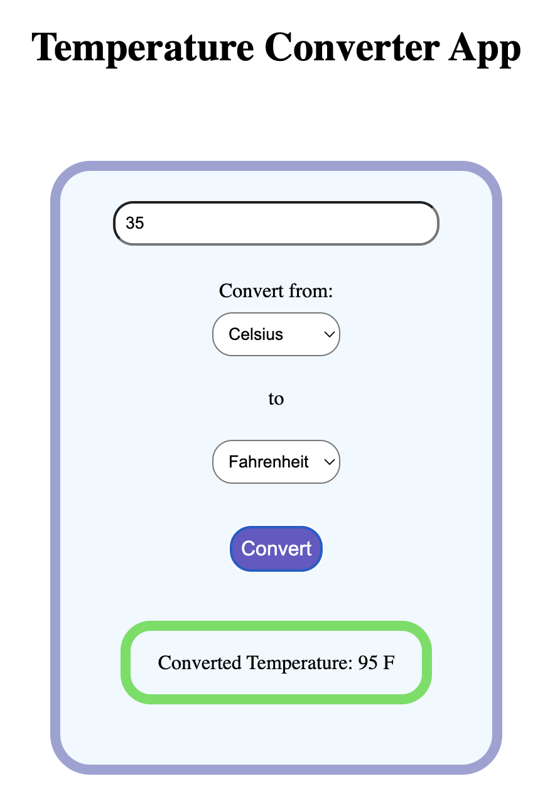

# Temperature Converter Project

## Output

## Overview

Build a temperature converter that allows users to convert between Celsius and Fahrenheit units. This project will help reinforce your understanding of JavaScript basics, DOM manipulation, and user interaction.

## Learning Objectives

- Work with variables and data types
- Implement mathematical operations
- Handle user input and output
- Practice DOM manipulation
- Apply basic styling with CSS

## Project Requirements

1. Create a web interface with:
    - Input field for temperature value
    - Dropdown or radio buttons to select conversion type (C to F or F to C)
    - Convert button
    - Display area for the result
    - Clear/Reset button

## Implementation Steps

### 1. Project Setup (10 minutes)

- Create a project folder
- Create three files: index.html, styles.css, and script.js
- Link the files together

### 2. HTML Structure (15 minutes)

- Create a container for the converter
- Add input fields and buttons
- Add a result display area
- Include necessary labels and headings

### 3. Styling (15 minutes)

- Style the container and form elements
- Make the interface responsive
- Add hover effects for buttons
- Ensure good spacing and alignment

### 4. JavaScript Logic (20 minutes)

- Create event listeners for buttons
- Implement the conversion formulas
- Add input validation
- Display the results

### 5. Testing & Refinement

- Test with different input values
- Verify conversion accuracy
- Test error handling
- Make sure the interface is user-friendly

## Conversion Formulas to Use

- Celsius to Fahrenheit: `(C × 9/5) + 32`
- Fahrenheit to Celsius: `(F - 32) × 5/9`
- Celsius to Kelvin: `C + 273.15`
- Kelvin to Celsius: `K - 273.15`
- Other conversions can be derived from these formulas.

## Additional Features (Optional)

- Add Kelvin conversion
- Implement real-time conversion
- Add temperature scale visualization
- Include conversion history
- Add a temperature facts section